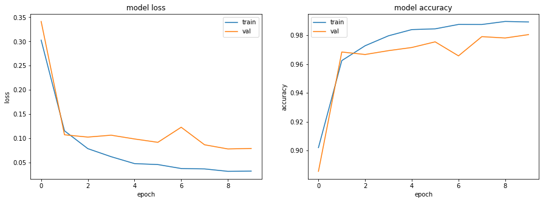
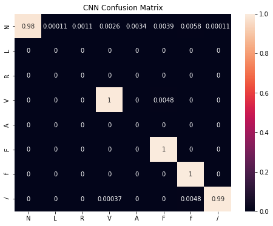
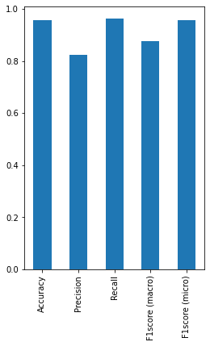

# Classification of beats using a CNN model and the leave out patients validation protocol


```python
import numpy as np
import glob
import matplotlib.pyplot as plt
import pandas as pd
from scipy import *
import os
import seaborn as sns
from sklearn import *
from sklearn.metrics import *
import tensorflow as tf
from tensorflow.keras.models import Sequential
from tensorflow.keras.layers import Dense, BatchNormalization
from tensorflow.keras.models import Model
from tensorflow.keras.utils import to_categorical
from tensorflow.keras.layers import Dropout
from tensorflow.keras.layers import Flatten
from tensorflow.keras.layers import Conv1D
from tensorflow.keras.layers import MaxPooling1D
length = 277
```

### Extract task-specific data and one-hot encode labels


```python
# Load the training and testing data:
train_values = np.empty(shape=[0, length])
test_values = np.empty(shape=[0, length])

train_beats = glob.glob('./train_patients.csv')
test_beats = glob.glob('./test_patients.csv')

for j in train_beats:
    print('Loading ', j)
    csvrows = np.loadtxt(j, delimiter=',')
    train_values = np.append(train_values, csvrows, axis=0)

for j in test_beats:
    print('Loading ', j)
    csvrows = np.loadtxt(j, delimiter=',')
    test_values = np.append(test_values, csvrows, axis=0)
    
print(train_values.shape)
print(test_values.shape)

# Separate the training and testing data, and one-hot encode Y:
X_train = train_values[:,:-2]
X_test = test_values[:,:-2]

X_train1 = X_train.reshape(-1, X_train.shape[1], 1)
X_test1 = X_test.reshape(-1, X_train.shape[1], 1)

y_train = train_values[:,-2]
y_test = test_values[:,-2]

y_train1 = to_categorical(y_train)
y_test1 = to_categorical(y_test)
```

    Loading  ../mimic3-code-main/module2_week1/train_patients.csv
    Loading  ../mimic3-code-main/module2_week1/test_patients.csv
    (206312, 277)
    (14380, 277)


### Create a performance metrics function


```python
def showResults(test, pred, model_name):
    accuracy = accuracy_score(test, pred)
    precision= precision_score(test, pred, average='macro')
    recall = recall_score(test, pred, average = 'macro')
    f1score_macro = f1_score(test, pred, average='macro') 
    f1score_micro = f1_score(test, pred, average='micro') 
    print("Accuracy  : {}".format(accuracy))
    print("Precision : {}".format(precision))
    print("Recall : {}".format(recall))
    print("f1score macro : {}".format(f1score_macro))
    print("f1score micro : {}".format(f1score_micro))
    cm=confusion_matrix(test, pred, labels=[1,2,3,4,5,6,7,8])
    return (model_name, round(accuracy,3), round(precision,3) , round(recall,3) , round(f1score_macro,3), 
            round(f1score_micro, 3), cm)
```

### Build the CNN architecture and train the model


```python
tf.compat.v1.disable_eager_execution()

verbose, epoch, batch_size = 1, 10, 64
activationFunction='relu'

def getModel():
    
    cnnmodel = Sequential()
    cnnmodel.add(Conv1D(filters=128, kernel_size=16,padding='same', activation='relu',input_shape=(X_train1.shape[1],X_train1.shape[2])))
    cnnmodel.add(BatchNormalization())
    cnnmodel.add(Conv1D(filters=32, kernel_size=16,padding='same', activation='relu'))
    cnnmodel.add(BatchNormalization())
    cnnmodel.add(Conv1D(filters=9, kernel_size=16,padding='same', activation='relu'))
    cnnmodel.add(MaxPooling1D(pool_size=4,padding='same'))
    cnnmodel.add(Flatten())
    cnnmodel.add(Dense(256, activation='relu'))
    cnnmodel.add(Dense(128, activation='relu'))
    cnnmodel.add(Dense(32, activation='relu'))
    cnnmodel.add(Dense(9, activation='softmax'))
    cnnmodel.compile(optimizer='adam', loss='categorical_crossentropy',metrics=['accuracy'])
    cnnmodel.summary()
    return cnnmodel

cnnmodel = getModel()

cnnhistory= cnnmodel.fit(X_train1, y_train1, epochs=epoch, verbose=verbose, validation_split=0.2, batch_size = batch_size)
cnnpredictions = cnnmodel.predict(X_test1, verbose=1)
```

    WARNING:tensorflow:From C:\Program Files\Python38\lib\site-packages\tensorflow\python\keras\layers\normalization.py:534: _colocate_with (from tensorflow.python.framework.ops) is deprecated and will be removed in a future version.
    Instructions for updating:
    Colocations handled automatically by placer.
    Model: "sequential"
    _________________________________________________________________
    Layer (type)                 Output Shape              Param #   
    =================================================================
    conv1d (Conv1D)              (None, 275, 128)          2176      
    _________________________________________________________________
    batch_normalization (BatchNo (None, 275, 128)          512       
    _________________________________________________________________
    conv1d_1 (Conv1D)            (None, 275, 32)           65568     
    _________________________________________________________________
    batch_normalization_1 (Batch (None, 275, 32)           128       
    _________________________________________________________________
    conv1d_2 (Conv1D)            (None, 275, 9)            4617      
    _________________________________________________________________
    max_pooling1d (MaxPooling1D) (None, 69, 9)             0         
    _________________________________________________________________
    flatten (Flatten)            (None, 621)               0         
    _________________________________________________________________
    dense (Dense)                (None, 256)               159232    
    _________________________________________________________________
    dense_1 (Dense)              (None, 128)               32896     
    _________________________________________________________________
    dense_2 (Dense)              (None, 32)                4128      
    _________________________________________________________________
    dense_3 (Dense)              (None, 9)                 297       
    =================================================================
    Total params: 269,554
    Trainable params: 269,234
    Non-trainable params: 320
    _________________________________________________________________
    Train on 165049 samples, validate on 41263 samples
    Epoch 1/10
    165049/165049 [==============================] - ETA: 0s - loss: 0.1255 - accuracy: 0.9586

    C:\Program Files\Python38\lib\site-packages\tensorflow\python\keras\engine\training.py:2426: UserWarning: `Model.state_updates` will be removed in a future version. This property should not be used in TensorFlow 2.0, as `updates` are applied automatically.
      warnings.warn('`Model.state_updates` will be removed in a future version. '


    165049/165049 [==============================] - 233s 1ms/sample - loss: 0.1255 - accuracy: 0.9586 - val_loss: 0.0625 - val_accuracy: 0.9778
    Epoch 2/10
    165049/165049 [==============================] - 232s 1ms/sample - loss: 0.0489 - accuracy: 0.9836 - val_loss: 0.0469 - val_accuracy: 0.9848
    Epoch 3/10
    165049/165049 [==============================] - 235s 1ms/sample - loss: 0.0344 - accuracy: 0.9885 - val_loss: 0.0371 - val_accuracy: 0.9878
    Epoch 4/10
    165049/165049 [==============================] - 235s 1ms/sample - loss: 0.0269 - accuracy: 0.9914 - val_loss: 0.0265 - val_accuracy: 0.9907
    Epoch 5/10
    165049/165049 [==============================] - 246s 1ms/sample - loss: 0.0221 - accuracy: 0.9930 - val_loss: 0.0265 - val_accuracy: 0.9920
    Epoch 6/10
    165049/165049 [==============================] - 264s 2ms/sample - loss: 0.0182 - accuracy: 0.9944 - val_loss: 0.0205 - val_accuracy: 0.9942
    Epoch 7/10
    165049/165049 [==============================] - 259s 2ms/sample - loss: 0.0164 - accuracy: 0.9949 - val_loss: 0.0170 - val_accuracy: 0.9951
    Epoch 8/10
    165049/165049 [==============================] - 257s 2ms/sample - loss: 0.0139 - accuracy: 0.9957 - val_loss: 0.0194 - val_accuracy: 0.9949
    Epoch 9/10
    165049/165049 [==============================] - 259s 2ms/sample - loss: 0.0128 - accuracy: 0.9961 - val_loss: 0.0154 - val_accuracy: 0.9962
    Epoch 10/10
    165049/165049 [==============================] - 257s 2ms/sample - loss: 0.0100 - accuracy: 0.9971 - val_loss: 0.0145 - val_accuracy: 0.9970


```python
# Save the model so we can visualize it with Netron (https://github.com/lutzroeder/netron):
tf.keras.models.save_model(cnnmodel, 'cnnmodel_module2.h5')
```

### CNN Loss vs Accuracy Plot


```python
fig, ax = plt.subplots(1, 2, figsize = (15, 5))
ax[0].plot(cnnhistory.history['loss'])
ax[0].plot(cnnhistory.history['val_loss'])
ax[0].set_title('model loss')
ax[0].set_ylabel('loss')
ax[0].set_xlabel('epoch')
ax[0].legend(['train', 'val'], loc='upper right')
ax[1].plot(cnnhistory.history['accuracy'])
ax[1].plot(cnnhistory.history['val_accuracy'])
ax[1].set_title('model accuracy')
ax[1].set_ylabel('accuracy')
ax[1].set_xlabel('epoch')
ax[1].legend(['train', 'val'], loc='upper left')
plt.show()
fig.savefig('cnn_leaveout_patients_loss_and_accuracy.jpg')
```





### CNN Performance Metrics


```python
cnn_predict=np.argmax(cnnpredictions,axis=1)
cnn_actual_value=np.argmax(y_test1,axis=1)
cnn_results = showResults(cnn_actual_value, cnn_predict,'CNN')

cnnmetrics = metrics.classification_report(cnn_actual_value, cnn_predict, digits=3)

categories=['N','L','R','V','A','F','f','/']
fig = plt.figure(figsize=(8,6))
cm = confusion_matrix(cnn_actual_value, cnn_predict, labels = [1, 2, 3, 4, 5, 6, 7, 8], normalize='true')
sns.heatmap(cm, annot=True, xticklabels=categories, yticklabels=categories)
plt.title('CNN Confusion Matrix')
plt.show()
fig.savefig('cnn_leaveout_patients_confusion_matrix_and_metrics_a.jpg', dpi = 400)
```

    C:\Program Files\Python38\lib\site-packages\sklearn\metrics\_classification.py:1221: UndefinedMetricWarning: Recall is ill-defined and being set to 0.0 in labels with no true samples. Use `zero_division` parameter to control this behavior.
      _warn_prf(average, modifier, msg_start, len(result))
    C:\Program Files\Python38\lib\site-packages\sklearn\metrics\_classification.py:1221: UndefinedMetricWarning: Recall and F-score are ill-defined and being set to 0.0 in labels with no true samples. Use `zero_division` parameter to control this behavior.
      _warn_prf(average, modifier, msg_start, len(result))


    Accuracy  : 0.9876216968011127
    Precision : 0.6017989050577904
    Recall : 0.6216358127609787
    f1score macro : 0.611306963346361
    f1score micro : 0.9876216968011126





```python
# performance metrics
CNN_results = pd.DataFrame(data=(cnn_results),index=('Model','Accuracy','Precision','Recall','F1score (macro)', 'F1score (micro)','CM'))
fig = plt.figure(figsize=(4,6))
CNN_results[0][1:6].plot(kind='bar')
plt.show()
fig.tight_layout()
fig.savefig('cnn_leaveout_patients_confusion_matrix_and_metrics_b.jpg', dpi = 400)
```





### Save CNN Model, Model weights and results


```python
#serialize weights to HDF5
if not os.path.exists('./model_weights/'):
    os.mkdir('model_weights')
cnnmodel.save("./model_weights/cnnmodel_patients.h5")
print("Saved model to disk")

#Use only when running on all data
CNN_results = pd.DataFrame(data=cnn_results,index=('Model','Accuracy','Precision','Recall','F1score (macro)', 'F1score (micro)','CM'))
print(CNN_results)

if not os.path.exists('./model_results/'):
    os.mkdir('model_results')
CNN_results.to_csv('./model_results/cnn_patients_results.csv', encoding='utf-8', index=False)
```

    Saved model to disk
                                                                     0
    Model                                                          CNN
    Accuracy                                                     0.988
    Precision                                                    0.602
    Recall                                                       0.622
    F1score (macro)                                              0.611
    F1score (micro)                                              0.988
    CM               [[9324, 1, 10, 25, 32, 37, 55, 1], [0, 0, 0, 0...

