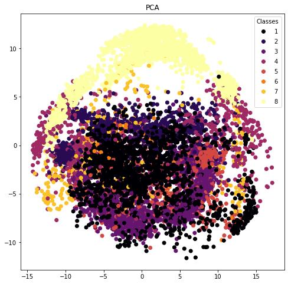
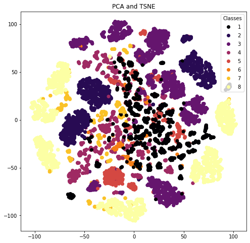
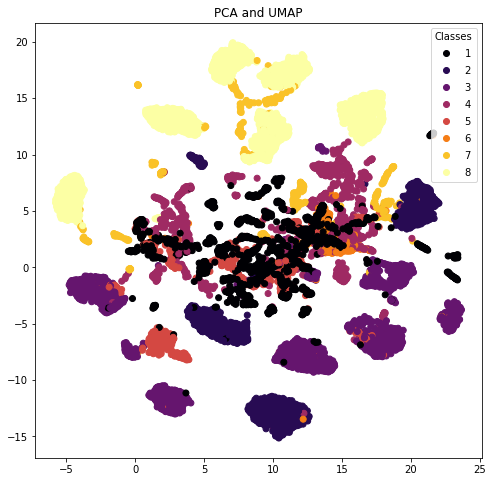

# Dimensionality reduction techniques to visualize ECG data


```python
import numpy as np
import glob
import matplotlib.pyplot as plt
import pandas as pd
import seaborn as sns
from scipy import *
from sklearn.decomposition import PCA
from sklearn.manifold import TSNE
import umap.umap_ as umap
length = 277
```

### Load beat holdout data


```python
# Load the training and testing data:
train_values = np.empty(shape=[0, length])
test_values = np.empty(shape=[0, length])

train_beats = glob.glob('./train_beats.csv')
test_beats = glob.glob('./test_beats.csv')

for j in train_beats:
    print('Loading ', j)
    csvrows = np.loadtxt(j, delimiter=',')
    train_values = np.append(train_values, csvrows, axis=0)

for j in test_beats:
    print('Loading ', j)
    csvrows = np.loadtxt(j, delimiter=',')
    test_values = np.append(test_values, csvrows, axis=0)
    
print(train_values.shape)
print(test_values.shape)

# Separate the training and testing data:
X_train = train_values[:,:-2]
X_test = test_values[:,:-2]

y_train = train_values[:,-2]
y_test = test_values[:,-2]
```

    Loading  ../mimic3-code-main/module2_week1/train_beats.csv
    Loading  ../mimic3-code-main/module2_week1/test_beats.csv
    (31912, 277)
    (37863, 277)


### Remove extra N class values


```python
X_test_noN = np.where(test_values[:,-2]==1.0)[0]
print(X_test_noN.shape)
X_test = np.delete(X_test, X_test_noN,0)
print(X_test.shape)

y_test_noN = np.where(test_values[:,-2]==1.0)[0]
print(y_test_noN.shape)
y_test = np.delete(y_test, y_test_noN,0)
print(y_test.shape)

N_vals = np.where(test_values[:,-2]==1)[0]
new_test = np.delete(test_values,N_vals[:27000],axis=0)
print(new_test.shape)
```

    (28703,)
    (9160, 275)
    (28703,)
    (9160,)
    (10863, 277)


### Compute and visualize PCA


```python
x_pca = PCA(n_components=50,random_state=42).fit_transform(new_test[:,:-2])

fig = plt.figure(figsize=(8,8))
categories=['N','L','R','V','A','F','f','/']
scatter = plt.scatter(x_pca[:,0],x_pca[:,1],c=new_test[:,-2], cmap='inferno')
plt.legend(title="Classes",loc='upper right',*scatter.legend_elements())
plt.title('PCA')
fig.savefig('pca_beat_classes.jpg', dpi = 400)
```





### Compute and visualize PCA + TSNE


```python
x_tsne = TSNE(n_components=2,random_state=42,perplexity=10, verbose=1).fit_transform(x_pca)

fig = plt.figure(figsize=(8,8))
categories=['N','L','R','V','A','F','f','/']
scatter = plt.scatter(x_tsne[:,0],x_tsne[:,1],c=new_test[:,-2], cmap='inferno')
plt.legend(title="Classes",loc='upper right',*scatter.legend_elements())
plt.title('PCA and TSNE')
fig.savefig('pca_tsne_beat_classes.jpg', dpi = 400)
```

    [t-SNE] Computing 31 nearest neighbors...
    [t-SNE] Indexed 10863 samples in 0.114s...
    [t-SNE] Computed neighbors for 10863 samples in 2.027s...
    [t-SNE] Computed conditional probabilities for sample 1000 / 10863
    [t-SNE] Computed conditional probabilities for sample 2000 / 10863
    [t-SNE] Computed conditional probabilities for sample 3000 / 10863
    [t-SNE] Computed conditional probabilities for sample 4000 / 10863
    [t-SNE] Computed conditional probabilities for sample 5000 / 10863
    [t-SNE] Computed conditional probabilities for sample 6000 / 10863
    [t-SNE] Computed conditional probabilities for sample 7000 / 10863
    [t-SNE] Computed conditional probabilities for sample 8000 / 10863
    [t-SNE] Computed conditional probabilities for sample 9000 / 10863
    [t-SNE] Computed conditional probabilities for sample 10000 / 10863
    [t-SNE] Computed conditional probabilities for sample 10863 / 10863
    [t-SNE] Mean sigma: 0.850130
    [t-SNE] KL divergence after 250 iterations with early exaggeration: 79.958763
    [t-SNE] KL divergence after 1000 iterations: 1.331498





### Compute and visualize PCA + UMAP


```python
reducer = umap.UMAP(n_components=2, random_state=42, n_neighbors=10, a = 0.5, b = 1.2)
embedding = reducer.fit_transform(x_pca)

fig = plt.figure(figsize=(8,8))
plt.scatter(reducer.embedding_[:, 0], reducer.embedding_[:, 1], c=new_test[:,-2], cmap='inferno')
plt.legend(title="Classes",loc='upper right',*scatter.legend_elements())
plt.title('PCA and UMAP')
fig.savefig('pca_umap_beat_classes.jpg', dpi = 400)
```




